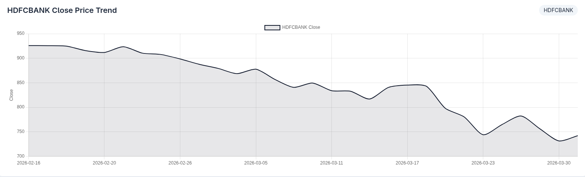
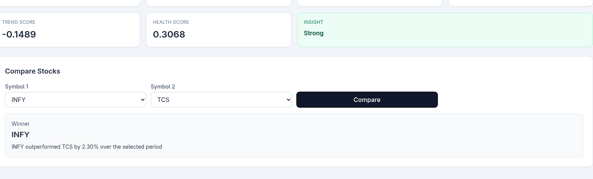

Stock Data Intelligence Dashboard — Turning Market Data into Actionable Insights

A mini financial analytics platform that transforms raw stock market data into meaningful insights through a clean backend system and interactive dashboard.

---

##  Problem Statement

Raw stock data (open, close, high, low) is difficult to interpret directly.

This project focuses on:
- Converting raw financial data into **actionable insights**
- Providing a simple interface to **analyze stock performance**
- Demonstrating a **data → processing → insight → visualization pipeline**

This enables users to:
- Quickly understand stock performance without digging into raw data  
- Compare companies efficiently  
- Make better data-driven observations  
---

##  Features

-  Fetches real stock data using **yfinance (NSE stocks)**
-  Computes key financial metrics:
  - Daily Return
  - Moving Average (7-day)
  - Volatility
  - Trend Score
-  Custom **Stock Health Score** with interpretation:
  - Strong / Moderate / Risky
-  Interactive chart visualization (Chart.js)
-  Compare two stocks with performance insights
-  REST API built with FastAPI

---

##  Architecture

Raw Stock Data (yfinance)
↓
Data Processing (Pandas)
↓
Metrics & Insights Layer
↓
FastAPI Backend (REST APIs)
↓
Frontend Dashboard (HTML + Tailwind + Chart.js)

The system separates data fetching, transformation, and presentation layers to ensure modularity, clarity, and scalability.
---

##  API Endpoints

### 1. Get Companies
GET /companies

### 2. Get Stock Data (Last 30 Days)
GET /data/{symbol}

### 3. Get Summary & Insights
GET /summary/{symbol}

Returns:
- 52-week high/low
- Average close
- Volatility
- Trend score
- Health score
- Insight (Strong / Moderate / Risky)

### 4. Compare Two Stocks
GET /compare?symbol1=INFY&symbol2=TCS

Returns:
- Performance difference
- Winner
- Human-readable insight

---

##  Custom Insights

###  Trend Score
Measures overall price movement:
(last_close - first_close) / first_close

### Volatility
Measures risk using standard deviation of returns.

###  Stock Health Score
Combines trend and risk:
health_score = (trend * 0.6) + ((1 - volatility) * 0.4)

### 🔹 Insight Interpretation
- **Strong** → positive trend, low risk  
- **Moderate** → balanced  
- **Risky** → negative trend or high volatility  

---

##  Frontend Dashboard

- Sidebar with company list
- Interactive price chart
- Summary cards with metrics
- Compare feature with insights

---

##  Setup Instructions

1. Clone the repository  
git clone https://github.com/PrasadNaik1310/jarnox_stockDashboard  
cd jarnox-stock-dashboard  

2. Install dependencies  

pip install -r requirements.txt  

3. Run backend server  
uvicorn backend.app.main:app --reload  

4. Open frontend 
cd frontend 
Open frontend/index.html in browser  

---

##  Screenshots
- Dashboard view  
./screenshot/dashboard.png
- Chart  
./screeshot/chart.png
- Compare feature  
./screenshot/compareFeature.png

---

##  Future Improvements

- Real-time stock data integration (using yfinance for now).  
- Machine learning-based price prediction  
- Caching for performance optimization  
- Authentication & user watchlists  

---

##  Tech Stack

- **Backend:** FastAPI, Python  
- **Data Processing:** Pandas, NumPy  
- **Data Source:** yfinance  
- **Frontend:** HTML, Tailwind CSS, Chart.js  

---

##  Conclusion

This project demonstrates how raw financial data can be transformed into meaningful insights through a structured backend system and simple visualization layer.

It emphasizes:
- Clean API design  
- Data processing pipelines  
- Insight generation over raw data  

It focuses not just on data retrieval, but on interpretation — which is critical in real-world financial systems.